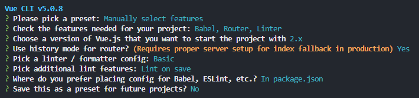

vue2 项目搭建

如果node-modules 安装失败 可以把node-modules包删除
然后使用 npm cache verify清除缓存

0. 切换下载源
  npm install -g cnpm --registry=http://registry.npmmirror.com

1. 全局安装 @vue/cli (脚手架 => 用于搭建v2环境)
  cnpm i @vue/cli -g
  vue --version    =>    @vue/cli 5.0.8

2. 基于@vue/cli搭建vue项目环境
  vue create xxx(项目名称)

3. 选择项目配置

5. 项目目录

6. 目录下src文件内容
