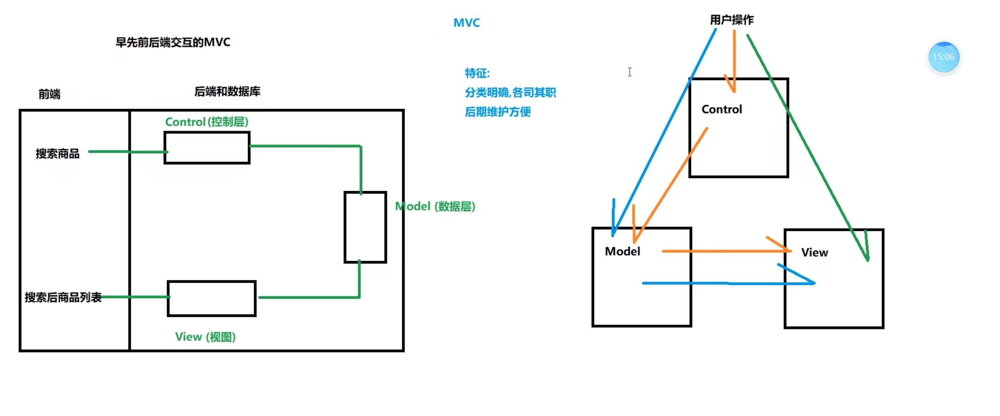
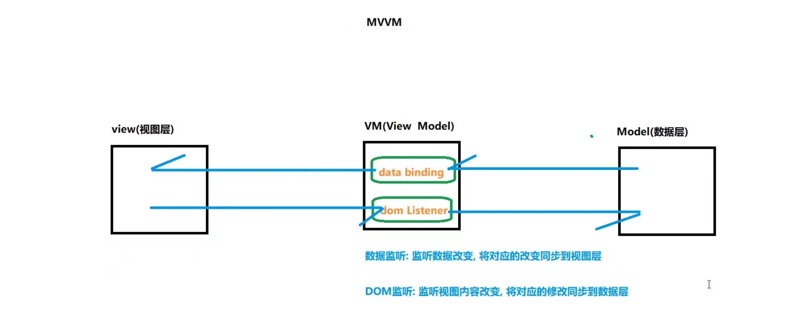

# vue-day7笔记
## 1. 动态组件
通过给component组件传递动态属性 :is 可以实现组件切换
  - 每次切换时,当前组件要被卸载(销毁),被切换的组件会进行初始化(组件中的数据)
  - 组件中的数据没有被记录下来,每次卸载时都会被销毁
  - 下次被在初始化还是使用初始值
```html
<body>
  <div id="app">
    <p>{{count}}</p>
    <button @click="count++">加</button>
    <!-- 通过v-if实现组件切换 当前组件显示,其他组件销毁(布局过程中所有组件 都需要写) -->
    <p>
      <button @click="showComp='comp-a'">comp-a</button>
      <button @click="showComp='comp-b'">comp-b</button>
      <button @click="showComp='comp-c'">comp-c</button>
    </p>
    <!-- 
      官方封装的一个组件 => 可以对应组件名称渲染某个组件
        is => 要求传入的组件名称 (可以是静态属性,也可以是动态属性)
     -->
    <component :is='showComp'></component>
  </div>
</body>
<template id="compA">
  <div class="compA">
    这是组件A
  </div>
</template>
<template id="compB">
  <div class="compB">
    这是组件B
  </div>
</template>
<template id="compC">
  <div class="compC">
    这是组件C
  </div>
</template>
<script>
  Vue.component('compA', {
    data() {
      return {}
    },
    template: "#compA",
    methods: {},
  })
  Vue.component('compB', {
    data() {
      return {}
    },
    template: "#compB",
    methods: {},
  })
  Vue.component('compC', {
    data() {
      return {}
    },
    template: "#compC",
    methods: {},
  })

  var vm = new Vue({
    el: '#app',
    data: {
      count: 1,
      showComp: 'comp-a'
    },
  })
</script>
```
### 1-1 keep-alive组件
- component 内置组件 => 组件动态切换
  - 如何知道组件切换 => mounted destroyed
    - -> 被销毁的组件触发 => destroyed
    - -> 被挂载的组件触发 => mounted
  - 缺点: 
    - 组件内卸载之后,数据也被清除了,没有数据缓存
- keep-alive配合component => 实现组件动态切换 (数据缓存)
  - -> 为了缓存组件数据,默认情况下组件不会被销毁(只有挂载没有销毁)
  - -> 虽然组件数据被缓存了,但是无法知道组件是否被 激活/失活
    - -> 解决方法: 新增钩子函数 activated 和 deactivated
      - -> activated   => 被 keep-alive 缓存的组件激活时调用
      - -> deactivated => 被 keep-alive 缓存的组件失活时调用
```html
<body>
  <div id="app">
    <p>{{count}}</p>
    <button @click="count++">加</button>
    <p>
      <button @click="showComp='comp-a'">comp-a</button>
      <button @click="showComp='comp-b'">comp-b</button>
      <button @click="showComp='comp-c'">comp-c</button>
    </p>
    <keep-alive>
      <component :is='showComp'></component>
    </keep-alive>
  </div>
</body>
<template id="compA">
  <div class="compA">
    这是组件A{{a}}
    <button @click="a++">a++</button>
  </div>
</template>
<template id="compB">
  <div class="compB">
    这是组件B:{{ms}}
  </div>
</template>
<template id="compC">
  <div class="compC">
    这是组件C
  </div>
</template>
<script>

  Vue.component('compA', {
    data() {
      return {
        a: 1
      }
    },
    template: "#compA",
    methods: {},
    mounted() {
      console.log("组件a被挂载");
    },
    destroyed() {
      console.log("组件a被卸载了");
    },
    activated() {
      console.log("组件a被激活");
    },
    deactivated() {
      console.log("组件a失活");
    },
  })

  Vue.component('compB', {
    data() {
      return {
        ms: 0,
        timer: null
      }
    },
    template: "#compB",
    methods: {},
    mounted() {
      console.log("组件b被挂载");
      clearInterval(this.timer)
      this.timer = setInterval(() => {
        // console.log(this.ms);
        this.ms += 10
      }, 10)
    },
    beforeDestroy() {
      clearInterval(this.timer)
    },
    destroyed() {
      console.log("组件b被卸载了");
    },
    activated() {
      console.log("组件b被激活");
    },
    deactivated() {
      console.log("组件b失活");
    },
  })
  Vue.component('compC', {
    data() {
      return {}
    },
    template: "#compC",
    methods: {},
    mounted() {
      console.log("组件c被挂载");
    },
    destroyed() {
      console.log("组件c被卸载了");
    },
    activated() {
      console.log("组件c被激活");
    },
    deactivated() {
      console.log("组件c失活");
    },
  })
  var vm = new Vue({
    el: '#app',
    data: {
      count: 1,
      showComp: 'comp-a'
    },
  })
</script>
```

### 1-2 keep-alive组件-相关属性
- 如果需要有一部分组件缓存,一部分组件不缓存
  - include - 字符串或正则表达式,数组,只有名称匹配的组件会被缓存
    - -> 字符串可以静态绑定,数组正则需要动态绑定
  - exclude - 字符串或正则表达式,数组,任何名称匹配的组件都不会被缓存
    - -> 字符串可以静态绑定,数组正则需要动态绑定
  - max - 数字,最多可以缓存多少组件实例
    - -> 最多可以缓存多少组件实例,一旦这个数字达到了,在新实例被创建之前,已缓存组件中最久没有被访问的实例会被销毁掉(先缓存的先销毁)
- **注意**:在keep-alive中添加属性时需要和组件名对应
```html
<!-- 字符串写法 -->
<keep-alive include="compA" exclude="compB">
  <component :is='showComp'></component>
</keep-alive>

<!-- 正则表达式 => 对象 => 动态绑定 -->
<keep-alive :include="/^compA|compB$/" :exclude="/^compC$/">
  <component :is='showComp'></component>
</keep-alive>

<!-- 数组 -->
<keep-alive :include="['compA','compB']" :exclude="['compC']">
  <component :is='showComp'></component>
</keep-alive>

<!-- max用法 => 最多可以缓存多少组件实例,一旦这个数字达到了,在新实例被创建之前,已缓存组件中最久没有被访问的实例会被销毁掉 -->
<keep-alive :include="['compA','compB']" :exclude="['compC']" :max="1">
  <component :is='showComp'></component>
</keep-alive>
```
## 2. MVC和MV VM
### 2-1 MVC

### 2-2 MVVM


## 3. 全局混入和局部混入(mixin)
## 3-1 全局混入
- 如何定义: Vue.mixin({})
- 所有组件都会混入(包括根组件) => 将提取出来的公共代码注入到每一个组件(一般不建议全局混入)
- 混入也可以进行全局注册。使用时格外小心！一旦使用全局混入，它将影响每一个之后创建的 Vue 实例
- 选项冲突:
  - 1. 如果组件内有同名属性和方法(methods、components 和 directives),将会使用组件内的
  - 2. 如果组件内有生命周期钩子函数,会合并成一个数组,都会触发
```js
Vue.mixin({
  data() {
    return {
      count: 1
    }
  },
  methods: {
    addCount() {
      this.count++
    }
  },
  mounted() {
    console.log('全局混入 已注入');
  },
})

Vue.component('com-a', {
  template: `<div>
    <p>{{count}}</p>
    <button @click="addCount">count++</button>
  </div>`,
  methods: {
    addCount() {
      this.count += 10
    }
  },
  mounted() {
    console.log('组件a已经挂载');
  }
})

Vue.component('com-b', {
  template: `<div>
    <p>{{count}}</p>
    <button @click="addCount">count++</button>
  </div>`,
})

Vue.component('com-c', {
  template: `<div>
    <p>{{count}}</p>
    <button @click="addCount">count++</button>
  </div>`,
})
```
### 3-2 局部混入
- 当组件被使用时才会混入
- 组件可以混入多个局部混入
- 如何定义: 直接声明一个对象,在需要使用混入的组件内声明一个mixins:['混入的名称']
```js
let mixinCount = {
  data() {
    return {
      count: 1
    }
  },
  // data: { count: 1 },
  methods: {
    addCount() {
      this.count++
    }
  },
  mounted() {
    console.log('全局混入 已注入');
  },
}
Vue.component('com-a', {
  mixins:[mixinCount],  // 组件可以混入多个局部混入
  template: `<div>
    <p>{{count}}</p>
    <button @click="addCount">count++</button>
  </div>`,
})
Vue.component('com-b', {
  template: `<div>
    <p>{{count}}</p>
    <button @click="addCount">count++</button>
  </div>`,
  methods: {
    addCount() {
      this.count+=10
    }
  },
})
Vue.component('com-c', {
  template: `<div>
    <p>{{count}}</p>
    <button @click="addCount">count++</button>
  </div>`,
})
```
## 4. 自定义指令
### 4-1 全局自定义指令
- 定义一次,所有的组件均可以使用
- 自定义指令相关的钩子函数
  - bind：只调用一次，指令第一次绑定到元素时调用。在这里可以进行一次性的初始化设置。
  - inserted：被绑定元素插入父节点时调用 (仅保证父节点存在，但不一定已被插入文档中)。
  - update：所在组件的 VNode 更新时调用，但是可能发生在其子 VNode 更新之前。指令的值可能发生了改变，也可能没有。但是你可以通过比较更新前后的值来忽略不必要的模板更新
- 钩子函数相关参数
  - el：指令所绑定的元素，可以用来直接操作 DOM
  - binding: 一个对象，包含指令相关的数据(指令名,指令值,指令表达式,参数,修饰符可以有多个)
    - name：指令名，不包括 v- 前缀。
    - value：指令的绑定值，例如：v-my-directive="1 + 1" 中，绑定值为 2。
    - oldValue：指令绑定的前一个值，仅在 update 和 componentUpdated 钩子中可用。无论值是否改变都可用。
    - expression：字符串形式的指令表达式。例如 v-my-directive="1 + 1" 中，表达式为 "1 + 1"。
    - arg：传给指令的参数，可选。例如 v-my-directive:foo 中，参数为 "foo"。
    - modifiers：一个包含修饰符的对象。例如：v-my-directive.foo.bar 中，修饰符对象为 { foo: true, bar: true }
```js
// 普通写法
Vue.directive('color', {
  // 插入父元素时执行一次
  inserted(el, binding) {
    console.log('el', el);
    console.log("binding", binding);
    let { value, arg = 'text' } = binding

    switch (arg) {
      case 'text': el.style.color = value; break;
      case 'bg': el.style.backgroundColor = value; break;
      case 'border': el.style.border = value; break;
    }
  },
  // 数据更新时再次执行
  update(el, binding) {
    let { value, arg = 'text' } = binding

    switch (arg) {
      case 'text': el.style.color = value; break;
      case 'bg': el.style.backgroundColor = value; break;
      case 'border': el.style.border = value; break;
    }
  },
})
// 简写-> 直接在第二参数传入一个函数,就会默认在第一次插入和更新的时候执行
Vue.directive('color', function (el, binding) {
  let { value, arg = 'text' } = binding

  switch (arg) {
    case 'text': el.style.color = value; break;
    case 'bg': el.style.backgroundColor = value; break;
    case 'border': el.style.border = value; break;
  }
})
```